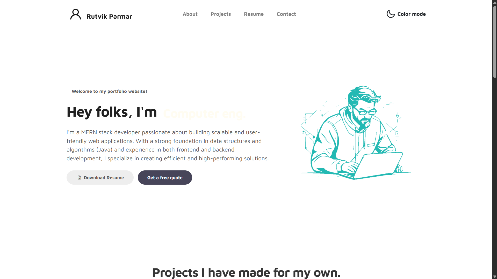

# 💼 Personal Portfolio Website

A clean, responsive, and modern personal portfolio website built using **HTML5**, **CSS3**, and **Vanilla JavaScript**. Designed to showcase my skills, projects, and contact information in a sleek, user-friendly layout.

## Live at
[text](https://rutvikp003.github.io/Html-portfolio/)


## 🚀 Features

- 🧑‍💻 About Me section
- 📂 Projects portfolio with hover effects
- ✉️ Contact form
- 📱 Fully responsive design (mobile-friendly)
- 🌙 Light/Dark theme toggle (if applicable)
- ⚡ Smooth scrolling and animations

## 🛠️ Technologies Used

- HTML5
- CSS3 (Flexbox/Grid)
- JavaScript (Vanilla)

## screenshots



## 🔧 Setup Instructions

1. Clone this repository:
   ```bash
   git clone https://github.com/yourusername/your-repo-name.git
